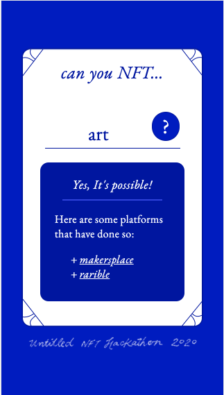

# can-u-nft
untitled nft hackathon

### Can U NFT?

Is an interactive, educational medium that aims to inform new users about NFTs. The site hosts a card-like component that takes in keywords that helps users determine whether it's possible to turn them into non-fungible tokens.

---

As a Designer who has an interest in the blockchain technology, I have always found NFTs to be quite confusing to understand. For this project, I want to create a fun and easy way to help new users get a better idea of what non-fungible tokens are as well as pique their curiosity in thinking about the untapped possibilities for NFTs.

One of my main ideas was to open discussions about what can or can't be turned into NFTs by making the cards exportable and shareable to social sites like twitter along with a filterable hashtag (ie #canuNFT)

It would be nice to have a new user's idea as to what they think could be a NFT. I think this simplified approach also takes away the anxiety I feel seeing a huge block of text trying to explain the tech behing NFTs and transforms them into bite sized pieces and in a choose-your-own-adventure way.

---

### V1 - Todo
- More canned responses based on keyword input
- Provide resources for existing NFT platforms
- Add illustrations
- NFT page / infographic - interactive and downloadable versions
- gsap transitions

### V2 - Nice to haves that I plan to further work on
- Share on Twitter with #canuNFT
- Save card div as image for download/sharing
- Smarter/better responses and resource lists
- log keyword inputs

