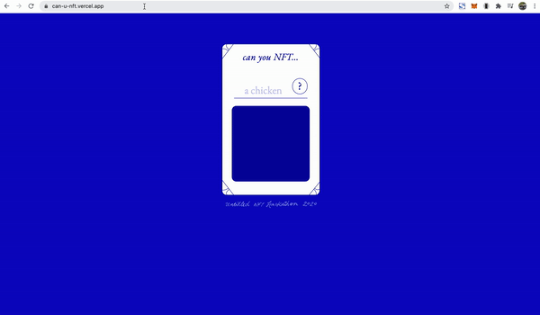
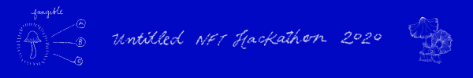
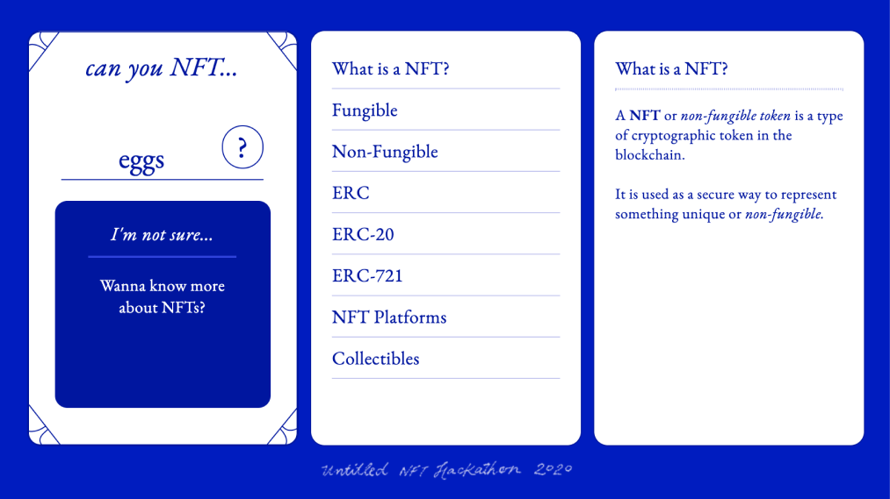

# can-u-nft
untitled nft hackathon

[Demo Here](https://can-u-nft.vercel.app/)

---

---

### Can U NFT?

Is an interactive, educational medium that aims to inform new users about NFTs. The site hosts a card-like component that takes in keywords that helps users determine whether it's possible to turn them into non-fungible tokens.

The goal for this project is to educate users about NFTs while also making them curious of its untapped possibilities!

---

As a Designer who has an interest in the blockchain technology, I have always found NFTs to be quite confusing to understand. For this project, I want to create a fun and easy way to help new users get a better idea of what non-fungible tokens are as well as pique their curiosity into thinking about the untapped possibilities for NFTs.

One of my main ideas was to encourage discussions about what can or can't be turned into NFTs by making the cards exportable and shareable to social sites like Twitter along with a filterable hashtag (ie #canuNFT)

It would be nice to have a new user's perspective as to what they think could be a NFT. I think this simplified approach also takes away the anxiety when seeing a huge block of text trying to explain the technology behind the tokens.

For further education, I decided to split up NFT info into bite sized pieces that they can swipe (on mobile) or scroll through (larger screens) along with fun fungi illustrations - I think the relation between the two (fungus and fungibility) can further help increase curiosity and fun!

There's still a lot of content and features that I want to include in this project, so I'll be listing them below and will continute to chip away slowly as I get free time :)

Feel free to reach me if you have any questions! I have also included downloadable/printable posters and materials via the resource link.

---

### V1 - Todo
- More canned responses based on keyword input
- Provide resources for existing NFT platforms
- Add illustrations
- NFT page / infographic - interactive and downloadable versions
- gsap transitions

#### needs fixing
- learn more button visibility
- scroll bar styling
- cases don't seem to work on some mobile browsers (goes to catch-all for some reason)

### V2 - Nice to haves that I plan to further work on
- Share on Twitter with #canuNFT
- Save card div as image for download/sharing
- Smarter/better responses and resource lists
- log keyword inputs

